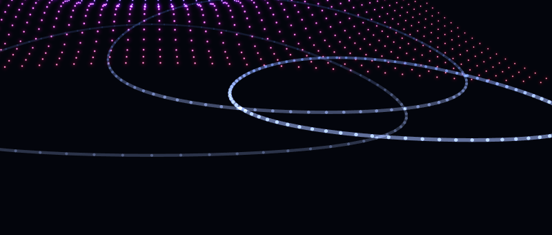

# 声浪 SongWave v2.1.3

按反馈把 3D 地面光环**调小**了，并且**触发方式可自选**。

## 1. 光环变小

新增「音域地形 → **光环大小**」滑块：`0.1× ~ 1.5×`，**默认 0.5×**
（半径约为上一版的一半、覆盖面约为 1/4）。引擎参数 `ringSize`，面板可调、自动记忆。

## 2. 触发方式可选

新增「音域地形 → **光环触发**」：

| 选项 | 行为 |
| --- | --- |
| **鼠标 + 音频**（默认） | 点画面在点击处扩散，重低音时从地形中心扩散 |
| 仅鼠标互动 | 只有点击才出现光环，音乐再炸也不出现 |
| 仅音频节拍 | 只有音乐节拍触发（从地形中心向外扩散），点画面不出现 |
| 关闭 | 完全关掉地面光环 |

引擎参数 `ringTrigger`（0/1/2/3），面板切换即时生效并记忆。

两个参数都作用在上一版的**3D 透视圆环**上：环仍逐段投影到地形斜面，
近处粗亮、远处细暗，且会跟着「俯视视角」一起变透视。

## 3. 验证

- 面板标签与引擎参数一致（`0.5×` / `鼠标 + 音频`，`ringSize=0.5`、`ringTrigger=0`）；
- 切到「仅音频节拍」后再点画面：光环**不再出现**（同区域总亮度 2031k → 589k，只剩地形本身）；
- 截图确认圆环变小、仍是椭圆透视（近端粗亮、远端细暗）。

## 4. 测试

`npm run test:all` —— **19 套 / 487 条断言全部通过**。

---

安装包：`SongWave-Setup-2.1.3.exe`（未签名，SmartScreen 提示时选"更多信息 → 仍要运行"）。
